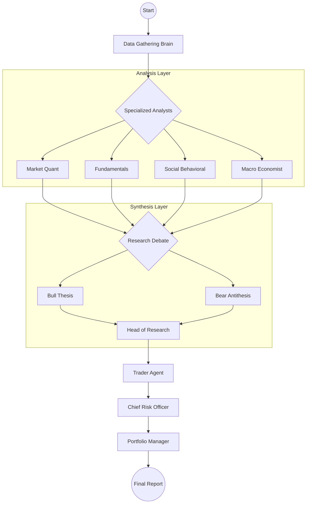

<p align="center">
  
</p>

<p align="center">
  
  
  
  
</p>

---

# TradingAgents: Research-Grade Financial Intelligence

**TradingAgents** is a state-of-the-art, multi-agent financial research framework designed to deliver forensic-level portfolio analysis and institutional-grade investment intelligence. By orchestrating a team of specialized AI personas, it transcends simple LLM prompts to simulate a full-scale research department.

Built on **LangGraph**, the platform implements an adversarial research pipeline where domain-expert agents debate market theses, identify hidden fragilities, and synthesize quantitative risk matrices.

> [!IMPORTANT]
> **Financial Disclaimer:** This system is for research and educational purposes only. It does not provide personalized financial advice, automated portfolio management, or trade execution instructions.

---

## 🚀 Key Features

- **Adversarial Debate Engine:** Features specialized **Bull** and **Bear** researchers who conduct rigorous "Pre-Mortem" analyses to identify blind spots in investment theses.
- **5-Layer Cognitive Architecture:**
  1. **Omnichannel Data Ingestion:** Real-time data from FMP, Finnhub, YFinance, AlphaVantage, NewsAPI, and Tavily.
  2. **Expert Domain Forensics:** specialized analysts for Market, News, Social Sentiment, Macroeconomics, and Fundamentals.
  3. **Adversarial Synthesis:** Peer-reviewed debate adjudicated by a Head of Research.
  4. **Tactical Risk Modeling:** 10-dimension quantitative risk matrix and black-swan stress testing.
  5. **Executive Unitization:** Final synthesis into a graded Portfolio Feedback report (A+ to F).
- **Structured Output (v0.2.4+):** Native Pydantic validation across all decision agents (Trader, PM, Research Manager) for deterministic, machine-readable intelligence.
- **Deep-Think Integration:** Optimized for deep-reasoning models including **DeepSeek-V3/R1**, **GPT-4o**, and **Claude 3.5 Sonnet**.
- **Persistence & Recovery:** Built-in LangGraph checkpointing for long-running research sessions and a persistent decision log for multi-session memory.

---

## 🧠 Agent Ecosystem

| Persona | Domain Expertise | Primary Output |
| :--- | :--- | :--- |
| **Market Analyst** | Technicals, Volume Profiles, Price Action | Momentum & Trend Report |
| **Fundamentals Analyst** | DuPont Decomposition, FCF Quality, Accruals | Financial Health Audit |
| **Social Analyst** | Retail Sentiment, Capitulation Cycles | Behavioral Risk Assessment |
| **Macro Economist** | Geopolitical Risk, Interest Rate Regimes | Macro Alignment Report |
| **Risk Analyst (CRO)** | Black-Swan Stress Testing, Correlation | 10D Risk Matrix |
| **Trader Agent** | Tactical Entry/Exit, Conviction Scoring | Execution Strategy |

---

## 📊 System Architecture



---

## 🛠️ Quick Start

### 1. Installation

```bash
# Clone the repository
git clone https://github.com/TauricResearch/TradingAgents.git
cd TradingAgents

# Install as editable package
pip install -e .
```

### 2. Configuration

Create a `.env` file in the root directory. TradingAgents supports multiple providers; you only need keys for the ones you plan to use.

```bash
# LLM Providers (Minimum 1 Required)
DEEPSEEK_API_KEY=your_key
NVIDIA_API_KEY=your_key
ANTHROPIC_API_KEY=your_key
OPENAI_API_KEY=your_key

# Data Vendors (Optional, falls back to yfinance)
FINANCIAL_MODELING_PREP_API_KEY=your_key
ALPHA_VANTAGE_API_KEY=your_key
FINNHUB_API_KEY=your_key
TAVILY_API_KEY=your_key
```

### 3. Usage

#### **CLI Mode**
Run a full forensic analysis from your terminal:
```bash
tradingagents --ticker AAPL --weight 0.5 --ticker MSFT --weight 0.5
```

#### **Web Dashboard**
Launch the FastAPI backend and glassmorphism UI:
```bash
uvicorn api:app --reload
```
Visit `http://localhost:8000` for the interactive experience.

#### **Python Integration**
```python
from tradingagents.graph.trading_graph import TradingAgentsGraph
from tradingagents.default_config import DEFAULT_CONFIG

# Define your portfolio
portfolio = [{"ticker": "NVDA", "weight": 1.0}]

# Initialize and Run
ta = TradingAgentsGraph(config=DEFAULT_CONFIG)
state, feedback = ta.analyze_portfolio(portfolio, "2024-05-10")

print(feedback)
```

---

## 🐳 Docker Deployment

Deploy the research platform in a containerized environment:

```bash
# Build the image
docker build -t trading-agents .

# Run the container
docker run -p 8000:8000 --env-file .env trading-agents
```

---

## 📜 Citation

If you use this framework in your research, please cite our work:

```bibtex
@misc{xiao2025tradingagentsmultiagentsllmfinancial,
      title={TradingAgents: Multi-Agents LLM Financial Trading Framework},
      author={Yijia Xiao and Edward Sun and Di Luo and Wei Wang},
      year={2025},
      eprint={2412.20138},
      archivePrefix={arXiv},
      primaryClass={q-fin.TR},
      url={https://arxiv.org/abs/2412.20138},
}
```

---
<p align="center">Developed with ❤️ by <a href="https://github.com/TauricResearch">Tauric Research</a></p>
